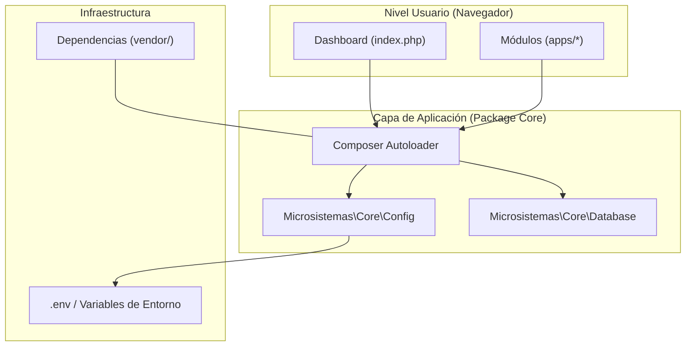
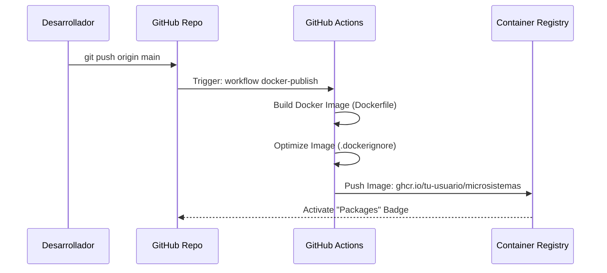

# Arquitectura del Sistema (ARCHITECTURE)

Este documento describe la estructura interna de **Microsistemas Suite**, centrándose en la implementación del patrón de Paquete PHP y el flujo de automatización.

## 🏗️ Estructura Global

El proyecto utiliza un enfoque híbrido: un **Paquete PHP Core** que sirve a múltiples **Micro-Apps** independientes.

---

## 📦 El Paquete PHP (`src/`)

La lógica compartida se organiza bajo el namespace `Microsistemas\`.

### 1. `Microsistemas\Core\Config`
Centraliza el acceso a la configuración. 
- Utiliza `vlucas/phpdotenv` para cargar archivos `.env`.
- Método `get($key, $default)` para recuperación segura.

### 2. `Microsistemas\Core\Database`
Gestiona el ciclo de vida de la conexión MySQL.
- Implementa el patrón **Singleton** para evitar múltiples conexiones innecesarias.
- Inyecta automáticamente credenciales desde `Config`.

---

## 🔄 Flujo de Integración Continua (CI)

Cada cambio en la rama `main` o en un `tag` dispara un proceso de despliegue automático hacia **GitHub Packages**.

---

## 🐳 Capas del Contenedor (Dockerfile)

La imagen oficial se basa en `php:8.2-apache` para maximizar la compatibilidad:
1.  **Base**: Debian Slim + Apache.
2.  **Ext**: Instalación de `mysqli`, `pdo_mysql` y `gd`.
3.  **App**: Copia del código y limpieza de rutas.
4.  **Security**: Configuración de permisos `www-data` y deshabilitación de navegación por carpetas.

---

## 🛠️ Estándares Utilizados
- **PSR-4**: Autoloading de clases.
- **12-Factor App**: Configuración por variables de entorno.
- **Semantic Versioning (SemVer)**: Tags `v1.x.x` para el control de versiones.
