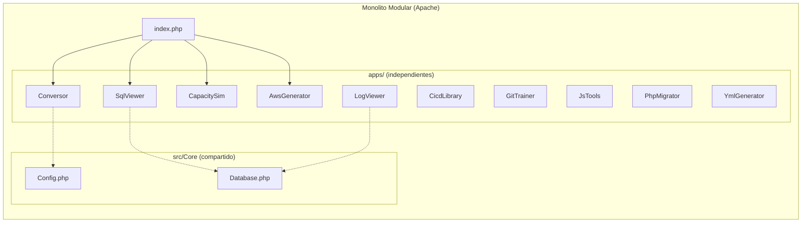
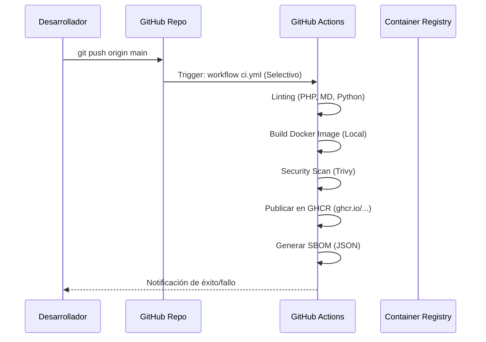
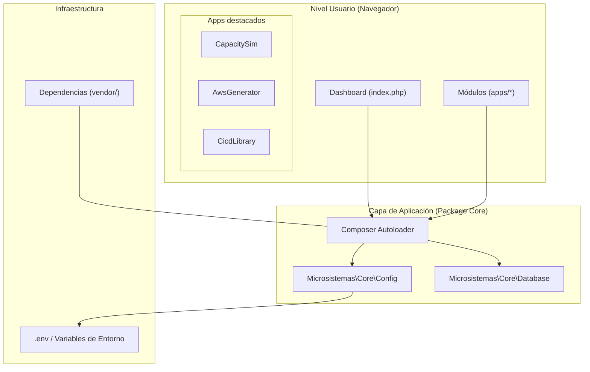

# Arquitectura del Sistema (ARCHITECTURE)

Este documento describe la estructura interna de **Microsistemas Suite**, los patrones arquitectónicos implementados, y el flujo de automatización del proyecto.

---

## 🧬 Patrones Arquitectónicos Identificados

Microsistemas no sigue una única arquitectura, sino una **combinación deliberada** de patrones que resuelven distintas necesidades del sistema:

### 1. 🧩 Monolito Modular (Modular Monolith)

Es la **arquitectura principal** del proyecto. Todo el sistema corre bajo un único proceso Apache, pero internamente cada directorio dentro de `apps/` es una **aplicación independiente y autocontenida**:

- Cada micro-app tiene su propio `index.php` o `index.html`, assets propios y un manifiesto `app.manifest.yml`.
- **No comparten código entre sí** — la única dependencia compartida es el Core (`src/`).
- Cualquier app puede extraerse a su propio servicio sin refactoring del resto.


```mermaid
graph LR
    subgraph "Monolito Modular (Apache)"
        Dashboard["index.php"]
        subgraph "apps/ (independientes)"
            A1["Conversor"]
            A2["SqlViewer"]
            A3["CapacitySim"]
            A4["AwsGenerator"]
            A5["CicdLibrary"]
            A6["GitTrainer"]
            A7["JsTools"]
            A8["LogViewer"]
            A9["PhpMigrator"]
            A10["YmlGenerator"]
        end
        subgraph "src/Core (compartido)"
            Config["Config.php"]
            Database["Database.php"]
        end
    end

    Dashboard --> A1
    Dashboard --> A2
    Dashboard --> A3
    Dashboard --> A4
    A1 -.-> Config
    A2 -.-> Database
    A8 -.-> Database
```

**¿Por qué Monolito Modular y no Microservicios?**
Un verdadero microservicio requiere despliegue independiente, su propia base de datos y comunicación por red. Microsistemas comparte un único Apache y una BD MySQL, pero mantiene la **independencia lógica** de cada app. Esto ofrece la simplicidad de un monolito con la organización de microservicios.

---

### 2. 🎯 Patrón Singleton — Core del Sistema

Las clases `Config` y `Database` implementan el **patrón Singleton**, garantizando una única instancia en memoria durante todo el ciclo de vida de cada solicitud HTTP:

- `Config::getInstance()` carga el `.env` una sola vez.
- `Database::getConnection()` y `Database::getPDO()` reutilizan la misma conexión.

**Beneficio:** Evita abrir múltiples conexiones a la base de datos por request, reduciendo el consumo de recursos y previniendo connection leaks.

---

### 3. 🌍 Metodología 12-Factor App

El proyecto sigue los principios de la metodología [12-Factor App](https://12factor.net) diseñada para aplicaciones SaaS modernas:

| Factor                     | Implementación en Microsistemas                              |
| :------------------------- | :------------------------------------------------------------ |
| **I. Codebase**            | Un repositorio Git, múltiples despliegues (Docker, XAMPP).    |
| **II. Dependencies**       | Explícitas en `composer.json`, instaladas vía `composer install`. |
| **III. Config**            | En variables de entorno (`.env`), nunca hardcodeada.          |
| **IV. Backing Services**   | MySQL como recurso adjunto, configurable por `.env`.          |
| **V. Build/Release/Run**   | `Dockerfile` → imagen inmutable → `docker-compose up`.       |
| **VI. Processes**          | Apache sirve sin estado en memoria (stateless).               |
| **X. Dev/Prod Parity**     | Mismo `Dockerfile` para desarrollo y producción.              |
| **XI. Logs**               | Stdout/stderr de Apache, no archivos propietarios.            |

---

### 4. 📦 PHP Package Pattern (PSR-4)

El directorio `src/` funciona como un **paquete PHP** con namespace `Microsistemas\` y autoloading PSR-4 vía Composer:

```json
"autoload": {
    "psr-4": {
        "Microsistemas\\": "src/"
    }
}
```

Las micro-apps consumen el Core a través de `require_once __DIR__ . '/vendor/autoload.php'`, sin necesidad de includes manuales. Esto permite que el Core evolucione independientemente de las apps.

---

### 5. 🐳 Infraestructura como Código (IaC)

Toda la infraestructura está definida como código versionado:

| Archivo/Directorio    | Qué define                                             |
| :-------------------- | :----------------------------------------------------- |
| `Dockerfile`          | Imagen de producción (PHP 8.2 + Apache + extensiones). |
| `docker-compose.yml`  | Orquestación local (web + MySQL + red + volúmenes).    |
| `k8s/demo/`           | Manifiestos Kubernetes (Deployment, Service, NetworkPolicy). |
| `.github/workflows/`  | Pipelines CI/CD (build, test, publish, scan).          |

**Beneficio:** El entorno completo se puede reproducir con un solo comando (`docker-compose up -d`), eliminando el problema de "funciona en mi máquina".

---

### 6. 🔄 CI/CD Pipeline Automatizado

Cada cambio en la rama `main` o en un `tag` dispara un proceso de despliegue automático hacia **GitHub Packages**.


```mermaid
sequenceDiagram
    participant Dev as Desarrollador
    participant GH as GitHub Repo
    participant GA as GitHub Actions
    participant GHCR as Container Registry

    Dev->>GH: git push origin main
    GH->>GA: Trigger: workflow ci.yml (Selectivo)
    GA->>GA: Linting (PHP, MD, Python)
    GA->>GA: Build Docker Image (Local)
    GA->>GA: Security Scan (Trivy)
    GA->>GA: Publicar en GHCR (ghcr.io/...)
    GA->>GA: Generar SBOM (JSON)
    GA-->>Dev: Notificación de éxito/fallo
```

---

## 🏗️ Estructura Global


```mermaid
graph TD
    subgraph "Nivel Usuario (Navegador)"
        Dashboard["Dashboard (index.php)"]
        Apps["Módulos (apps/*)"]
        subgraph "Apps destacados"
            CapacitySim
            AwsGenerator
            CicdLibrary
        end
    end

    subgraph "Capa de Aplicación (Package Core)"
        Autoloader["Composer Autoloader"]
        Config["Microsistemas\Core\Config"]
        Database["Microsistemas\Core\Database"]
    end

    subgraph "Infraestructura"
        Env[".env / Variables de Entorno"]
        Vendor["Dependencias (vendor/)"]
    end

    Dashboard --> Autoloader
    Apps --> Autoloader
    Autoloader --> Config
    Autoloader --> Database
    Config --> Env
    Vendor --- Autoloader
```

---

## 📦 El Paquete PHP (`src/`)

La lógica compartida se organiza bajo el namespace `Microsistemas\`.

### `Microsistemas\Core\Config`

Centraliza el acceso a la configuración.

- Utiliza `vlucas/phpdotenv` para cargar archivos `.env`.
- Método `get($key, $default)` para recuperación segura.
- Patrón Singleton con `getInstance()`.

### `Microsistemas\Core\Database`

Gestiona el ciclo de vida de las conexiones a base de datos.

- Implementa el patrón **Singleton** para evitar múltiples conexiones innecesarias.
- Soporta **MySQLi** (compatibilidad legacy) y **PDO** (MySQL, PostgreSQL, SQLite).
- Inyecta automáticamente credenciales desde `Config`.

---

## 🐳 Imagen Docker de Producción

La imagen oficial se basa en `php:8.2-apache` para maximizar la compatibilidad:

1. **Base**: Debian Bookworm + Apache.
2. **Extensiones**: Instalación de `mysqli`, `pdo_mysql` y `gd`.
3. **Seguridad**: Composer como usuario `www-data`, permisos granulares (755/644).
4. **Healthcheck**: `curl -f http://localhost/` cada 30 segundos.
5. **Límites**: 1 CPU, 512MB RAM por servicio.

---

## 📊 Resumen de Arquitecturas

| Patrón/Arquitectura            | ¿Dónde se aplica?                              | Propósito                                    |
| :----------------------------- | :---------------------------------------------- | :------------------------------------------- |
| **Monolito Modular**           | `apps/` — 10 micro-apps independientes          | Organización modular sin complejidad de red.  |
| **Shared Core Library (PSR-4)**| `src/Core/` — Config + Database                 | Código compartido sin duplicación.            |
| **Singleton**                  | `Config.php`, `Database.php`                    | Una conexión/config por request.              |
| **12-Factor App**              | `.env`, Dockerfile, Composer                    | Portabilidad entre entornos.                  |
| **Infrastructure as Code**     | `Dockerfile`, `docker-compose.yml`, `k8s/`      | Entornos reproducibles y versionados.         |
| **CI/CD Pipeline**             | `.github/workflows/`                            | Calidad y despliegue automatizado.            |

---

## 🛠️ Estándares Utilizados

- **PSR-4**: Autoloading de clases.
- **PSR-12**: Estilo de código PHP (enforced por PHP CS-Fixer).
- **12-Factor App**: Configuración por variables de entorno.
- **Semantic Versioning (SemVer)**: Tags `v1.x.x` para el control de versiones.

---

## Conclusión

Microsistemas es un **Monolito Modular** con Core compartido, infraestructura containerizada y CI/CD automatizado. No es un microservicio puro (todo corre en un único Apache), pero cada app es suficientemente independiente como para extraerse a su propio servicio si la escala lo requiere en el futuro. Esta arquitectura ofrece el **mejor balance entre simplicidad operativa y flexibilidad de evolución**.
