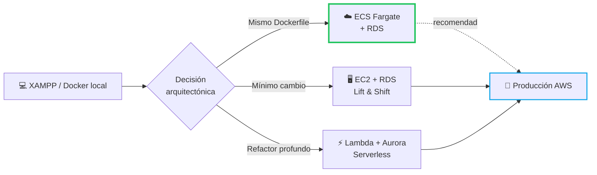
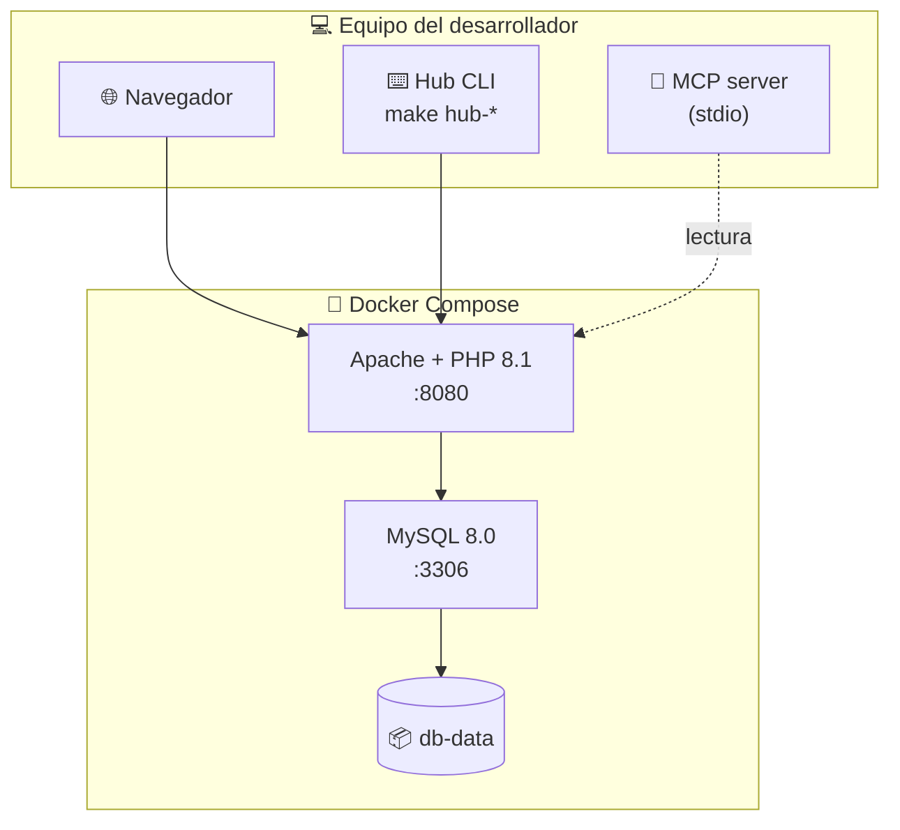
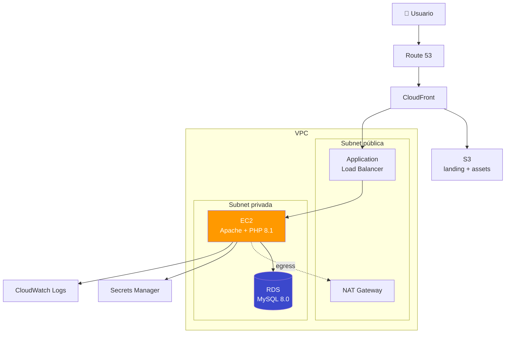
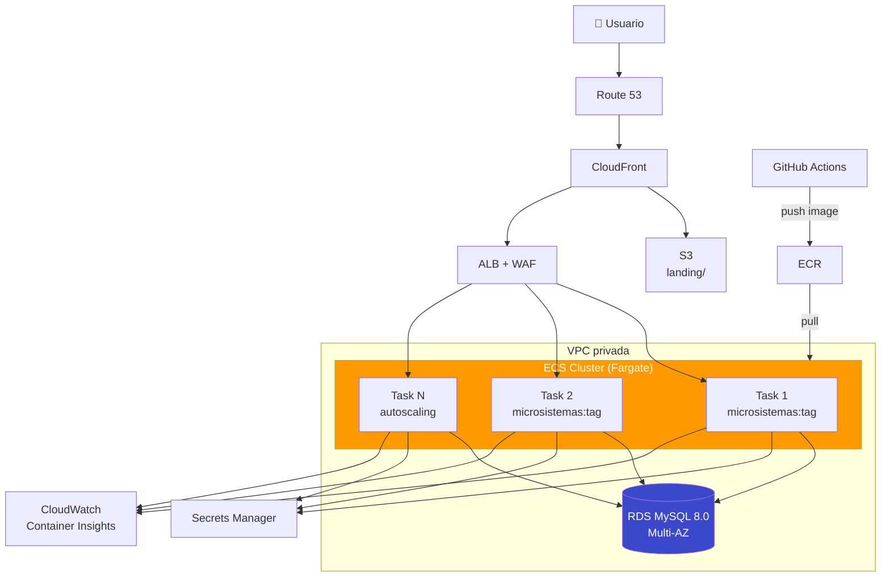
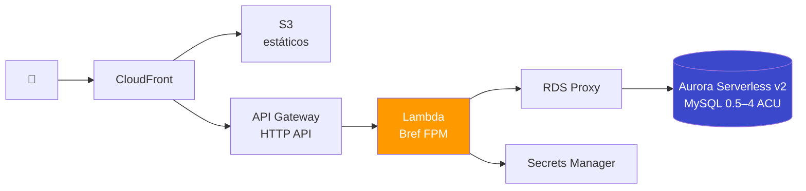
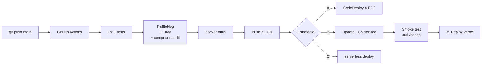
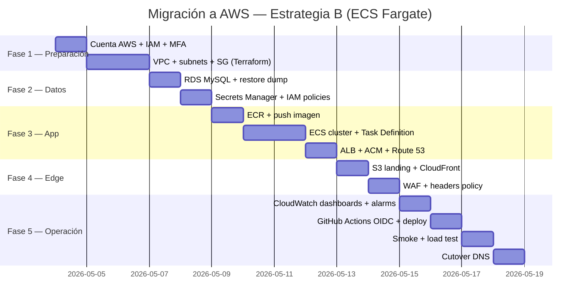

<div align="center">

# ☁️ Migración a AWS — Microsistemas Suite

### Guía completa de despliegue en la nube de Amazon Web Services

[](https://aws.amazon.com)
[](https://php.net)
[](https://docker.com)
[](https://terraform.io)
[](#)

<br>

Análisis profundo y plan paso a paso para llevar **Microsistemas Suite** desde XAMPP/Docker local hasta una infraestructura productiva en AWS.<br>
Incluye **3 estrategias** de despliegue, comparativas de costos, diagramas de arquitectura y guías ejecutables.

<br>

[Volver al README](../README.md) &nbsp;·&nbsp;
[Arquitectura actual](ARCHITECTURE.md) &nbsp;·&nbsp;
[Seguridad](../SECURITY.md) &nbsp;·&nbsp;
[Modos de ejecución](../OPERATING-MODES.md)

</div>

---

## 📑 Tabla de contenidos

1. [Resumen ejecutivo](#-resumen-ejecutivo)
2. [Stack actual y requisitos a cubrir](#-stack-actual-y-requisitos-a-cubrir)
3. [Estrategias de migración (3 opciones)](#-estrategias-de-migración-3-opciones)
4. [Estrategia A — Lift & Shift con EC2 + RDS](#-estrategia-a--lift--shift-ec2--rds)
5. [Estrategia B — Contenedores con ECS Fargate + RDS](#-estrategia-b--contenedores-ecs-fargate--rds)
6. [Estrategia C — Serverless con Lambda + Aurora Serverless v2](#-estrategia-c--serverless-lambda--aurora-serverless-v2)
7. [Servicios AWS transversales](#-servicios-aws-transversales)
8. [Comparativa de costos](#-comparativa-de-costos-mensual-estimado)
9. [Seguridad y cumplimiento en AWS](#-seguridad-y-cumplimiento-en-aws)
10. [CI/CD hacia AWS](#-cicd-hacia-aws)
11. [Observabilidad y operación](#-observabilidad-y-operación)
12. [Plan de migración paso a paso](#-plan-de-migración-paso-a-paso)
13. [Recomendación final](#-recomendación-final)
14. [Anexos: snippets y referencias](#-anexos-snippets-y-referencias)

---

## 🎯 Resumen ejecutivo

**Microsistemas Suite** es un monolito modular PHP 8.1 + MySQL 8.0 servido por Apache, con 12 microapps independientes,
landing estática, servidor MCP local y un stack Docker reproducible. La arquitectura *12-Factor* y la separación
limpia entre `apps/`, `src/Core` y assets estáticos lo hacen **altamente portable a la nube**.

> **TL;DR**
> - **Mejor relación costo / esfuerzo** → **ECS Fargate + RDS MySQL + CloudFront + S3** (Estrategia B)
> - **Más rápido para validar** → **Elastic Beanstalk** o **App Runner** (subset de Estrategia A/B)
> - **Costo mínimo en idle** → **Aurora Serverless v2 + Lambda + API Gateway** (Estrategia C, requiere refactor)



---

## 🧱 Stack actual y requisitos a cubrir

| Componente local | Tecnología | Equivalente AWS sugerido |
| :--- | :--- | :--- |
| Apache 2.4 + PHP 8.1 (FPM) | Imagen Docker `php:8.1-apache` | EC2 / Fargate / Beanstalk / App Runner |
| MySQL 8.0.40 | Contenedor Docker | **RDS for MySQL** o **Aurora MySQL** |
| Volumen `db-data` | Docker volume local | **EBS gp3** (EC2) o **RDS storage** |
| Landing estática (`landing/`) | HTML/CSS/JS plano | **S3 + CloudFront** |
| Assets de microapps | Estáticos por app | **S3** detrás de CloudFront |
| `.env` con secretos | Archivo en disco | **AWS Secrets Manager** o **SSM Parameter Store** |
| Logs Apache (stdout) | `docker logs` | **CloudWatch Logs** |
| Healthcheck `/apps/CapacitySim/health/` | Curl interno | **ALB target group** o **Route 53 health check** |
| Hub CLI (`make hub-*`) | Local | Permanece local; CI/CD vía GitHub Actions |
| Servidor MCP (`mcp/`) | Stdio local | **No se migra** — sigue siendo local por diseño |

### 📐 Arquitectura actual (referencia)



---

## 🛣️ Estrategias de migración (3 opciones)

| # | Estrategia | Esfuerzo | Costo idle | Costo escala | Refactor |
| :-: | :--- | :-: | :-: | :-: | :-: |
| **A** | **Lift & Shift** — EC2 + RDS | 🟢 Bajo | 🟡 Medio | 🟡 Medio | Ninguno |
| **B** | **Contenedores** — ECS Fargate + RDS | 🟡 Medio | 🟡 Medio | 🟢 Bueno | Mínimo (ya hay Dockerfile) |
| **C** | **Serverless** — Lambda + Aurora Serverless | 🔴 Alto | 🟢 Mínimo | 🟢 Excelente | Profundo (Bref / API Gateway) |

> Existen además dos **atajos PaaS** que envuelven A y B:
> - **AWS Elastic Beanstalk** (envuelve EC2 + RDS + ALB con un comando)
> - **AWS App Runner** (envuelve un contenedor con TLS y autoscaling sin gestionar VPC)

---

## 🅰️ Estrategia A — Lift & Shift (EC2 + RDS)

> **Filosofía:** mover lo mínimo. Replicar XAMPP en una VM administrada y mover la BD a un servicio gestionado.

### 🧩 Componentes

| Servicio | Rol |
| :--- | :--- |
| **Amazon EC2** (t3.small / t3.medium) | Servidor Apache + PHP 8.1 |
| **Amazon RDS for MySQL 8.0** | Base de datos gestionada con backups automáticos |
| **Application Load Balancer (ALB)** | TLS, healthchecks, routing |
| **Amazon Route 53** | DNS público |
| **AWS Certificate Manager (ACM)** | Certificado TLS gratuito |
| **Amazon S3 + CloudFront** | Landing estática y assets cacheados |
| **AWS Secrets Manager** | `DB_PASS`, `DB_APP_PASS` |
| **CloudWatch Logs / Metrics** | Observabilidad |
| **VPC + Subnets públicas/privadas** | Aislamiento de red |

### 🗺️ Diagrama



### 🔧 Paso a paso

```bash
# 0. Pre-requisitos: AWS CLI v2 configurado, dominio en Route 53 (opcional)
aws configure

# 1. Crear VPC con subnets pública y privada (CloudFormation o Terraform)
#    — 2 AZ para alta disponibilidad de RDS

# 2. Crear RDS MySQL 8.0
aws rds create-db-instance \
  --db-instance-identifier microsistemas-db \
  --db-instance-class db.t3.micro \
  --engine mysql --engine-version 8.0.40 \
  --allocated-storage 20 --storage-type gp3 \
  --master-username admin \
  --master-user-password "$(aws secretsmanager get-random-password --query RandomPassword --output text)" \
  --vpc-security-group-ids sg-xxx --db-subnet-group-name microsistemas-priv \
  --backup-retention-period 7 --deletion-protection

# 3. Lanzar EC2 t3.small con Amazon Linux 2023
#    user-data: instala Apache, PHP 8.1, composer, clona repo y arranca

# 4. Asociar IAM Role con permisos a Secrets Manager + CloudWatch

# 5. ALB con target group apuntando a EC2:8080, healthcheck en /apps/CapacitySim/health/

# 6. ACM: solicitar certificado y validar por DNS en Route 53

# 7. S3 + CloudFront: subir landing/ y configurar OAC

# 8. Smoke test
curl https://microsistemas.tu-dominio.com/
```

### ✅ Ventajas
- Cero refactor: el código corre tal cual.
- Familiar: cualquier sysadmin lo entiende.
- Apto para Hub CLI vía SSH/Session Manager.

### ⚠️ Desventajas
- Pagas la EC2 24/7 aunque no haya tráfico.
- Tú parchas el SO y PHP.
- Escalado horizontal requiere AMI + Auto Scaling Group.

---

## 🅱️ Estrategia B — Contenedores (ECS Fargate + RDS)

> **Filosofía:** aprovechar el `Dockerfile` existente. AWS corre el contenedor; tú no gestionas servidores.
> **Es la opción recomendada** para Microsistemas.

### 🧩 Componentes

| Servicio | Rol |
| :--- | :--- |
| **Amazon ECR** | Registro privado de imágenes Docker |
| **Amazon ECS** con **Fargate** | Orquestación serverless de contenedores |
| **Application Load Balancer** | Frente HTTPS al servicio Fargate |
| **Amazon RDS for MySQL 8.0** | Base de datos gestionada |
| **AWS Secrets Manager** | Inyecta `DB_PASS` al contenedor en runtime |
| **Amazon EFS** *(opcional)* | Almacenamiento compartido si una app lo requiere |
| **CloudFront + S3** | CDN para landing y assets |
| **CloudWatch Container Insights** | Métricas y logs por tarea |
| **AWS WAF** *(opcional)* | Reglas OWASP delante del ALB |

### 🗺️ Diagrama



### 🔧 Paso a paso

```bash
# 1. Crear repositorio en ECR
aws ecr create-repository --repository-name microsistemas

# 2. Build + push de la imagen (mismo Dockerfile del repo)
ACCOUNT=$(aws sts get-caller-identity --query Account --output text)
REGION=us-east-1
aws ecr get-login-password --region $REGION | \
  docker login --username AWS --password-stdin $ACCOUNT.dkr.ecr.$REGION.amazonaws.com
docker build -t microsistemas:1.0.0 .
docker tag  microsistemas:1.0.0 $ACCOUNT.dkr.ecr.$REGION.amazonaws.com/microsistemas:1.0.0
docker push                     $ACCOUNT.dkr.ecr.$REGION.amazonaws.com/microsistemas:1.0.0

# 3. Crear RDS MySQL (igual que Estrategia A)

# 4. Guardar secretos
aws secretsmanager create-secret --name microsistemas/db --secret-string \
  '{"DB_PASS":"...","DB_APP_PASS":"..."}'

# 5. Definir Task Definition (Fargate, 0.5 vCPU / 1 GB)
#    — environment: DB_HOST=<rds-endpoint>
#    — secrets: DB_PASS desde Secrets Manager

# 6. Crear servicio ECS con desiredCount=2 detrás de ALB

# 7. Habilitar autoscaling: target tracking en CPU 60% (1..6 tareas)

# 8. CloudFront frente a ALB + S3 de landing
```

### ✅ Ventajas
- Reutiliza el `Dockerfile` 1:1.
- Sin servidores que parchar.
- Autoscaling fino y rolling updates nativos.
- Coste detenido cuando `desiredCount=0`.

### ⚠️ Desventajas
- Requiere familiaridad con ECS/IAM.
- Apache + PHP no es ideal para *cold scale* extremo (mejor Estrategia C en ese caso).

### 🟢 Alternativa simplificada: AWS App Runner

Si quieres saltarte ALB, VPC y task definitions:

```bash
aws apprunner create-service \
  --service-name microsistemas \
  --source-configuration '{"ImageRepository":{...ECR...}}' \
  --instance-configuration "Cpu=1 vCPU,Memory=2 GB"
```

App Runner provisiona TLS, dominio, autoscaling y healthchecks por ti. **Costo aproximado: 1.5–2× ECS Fargate**, pero a cambio de ~80% menos configuración.

---

## 🅲 Estrategia C — Serverless (Lambda + Aurora Serverless v2)

> **Filosofía:** pagar solo por request. Requiere **refactor profundo**.

### 🧩 Componentes

| Servicio | Rol |
| :--- | :--- |
| **AWS Lambda** + capa **Bref** | Ejecuta PHP 8.1 sin servidor |
| **API Gateway HTTP API** | Frontend HTTP, ruteo a Lambda |
| **Amazon Aurora Serverless v2 MySQL** | BD que escala a 0.5 ACU mínima |
| **RDS Proxy** | Pool de conexiones (crítico con Lambda) |
| **S3 + CloudFront** | Estáticos y assets de microapps |
| **EFS for Lambda** *(si se necesita FS compartido)* | Almacenamiento persistente |
| **EventBridge** | Cron jobs (sustituye a `make` schedules) |

### 🗺️ Diagrama



### 🔧 Paso a paso (alto nivel)

```bash
# 1. composer require bref/bref bref/laravel-bridge   # o equivalente
# 2. Crear serverless.yml por microapp (cada app => 1 Lambda)
# 3. Aurora Serverless v2: minCapacity=0.5, maxCapacity=4 ACU
# 4. RDS Proxy delante de Aurora — IAM auth desde Lambda
# 5. Deploy:  serverless deploy
```

### ✅ Ventajas
- Coste casi 0 sin tráfico.
- Escala automática a miles de requests/seg.
- Sin servidores ni parches.

### ⚠️ Desventajas
- **Refactor importante:** sesiones PHP, archivos temporales, `.htaccess`, MCP local.
- Cold starts (mitigables con Provisioned Concurrency).
- 12 microapps → 12 Lambdas → más complejidad operativa.
- Algunas apps con assets pesados (PythonEval3000, KatasMultiLang) requieren EFS o S3.

> ⚠️ **Recomendación honesta:** Estrategia C **no es la mejor opción inicial** para Microsistemas porque el proyecto está pensado como suite local/Docker. Considérala si en el futuro algunas apps tienen tráfico esporádico y quieres bajar el costo idle a casi cero.

---

## 🧰 Servicios AWS transversales

Estos servicios aplican a las tres estrategias:

| Categoría | Servicio | Para qué |
| :--- | :--- | :--- |
| **CDN / Estáticos** | CloudFront + S3 | Landing, assets, cache global, TLS gratis |
| **DNS** | Route 53 | Dominio + healthchecks + failover |
| **TLS** | ACM | Certificados gratuitos auto-renovables |
| **Secretos** | Secrets Manager / SSM Parameter Store | `DB_PASS`, tokens, claves API |
| **Logs** | CloudWatch Logs | Stdout de Apache / Fargate / Lambda |
| **Métricas** | CloudWatch Metrics + Alarms | CPU, memoria, errores 5xx |
| **Trazas** | AWS X-Ray | Latencia por microapp |
| **Backups** | AWS Backup | Snapshots RDS + S3 versioning |
| **WAF** | AWS WAF + Shield Standard | OWASP Top 10, rate limiting, geo-block |
| **Identidad** | IAM + IAM Identity Center (SSO) | Acceso de equipo |
| **Costos** | Cost Explorer + Budgets | Alertas si supera el presupuesto |
| **IaC** | CloudFormation / **Terraform** / CDK | Infra reproducible |
| **Auditoría** | CloudTrail + Config | Registro de cambios |

---

## 💰 Comparativa de costos (mensual estimado)

> Precios orientativos región **us-east-1**, Noviembre 2025. Pueden cambiar — verifica en [AWS Pricing Calculator](https://calculator.aws).

### Escenario *baja carga* (proyecto personal / portfolio)

| Concepto | Estrategia A — EC2 | Estrategia B — Fargate | Estrategia C — Serverless |
| :--- | :-: | :-: | :-: |
| Cómputo | EC2 t3.small 24/7 → **~$15** | 1 task 0.5 vCPU/1GB 24/7 → **~$13** | 1M req Lambda → **~$0.20** |
| Base de datos | RDS db.t3.micro → **~$15** | RDS db.t3.micro → **~$15** | Aurora Serverless 0.5 ACU 50% → **~$22** |
| Almacenamiento | EBS 20 GB → ~$2 | RDS 20 GB → ~$2 | Aurora 10 GB → ~$1 |
| ALB / API GW | ALB → **~$18** | ALB → **~$18** | API GW HTTP → **~$1** |
| NAT Gateway | NAT → **~$32** | NAT → **~$32** | (no requerido) |
| CloudFront + S3 | ~$1 | ~$1 | ~$1 |
| Route 53 + ACM | ~$0.50 | ~$0.50 | ~$0.50 |
| Secrets Manager | ~$0.40 | ~$0.40 | ~$0.40 |
| CloudWatch | ~$3 | ~$5 | ~$2 |
| **TOTAL aprox.** | **~$87 / mes** | **~$87 / mes** | **~$28 / mes** |

> 💡 **Truco anti-NAT:** para baja carga, sustituye NAT Gateway (~$32/mes) por **VPC endpoints** para S3, ECR y Secrets Manager → bajas a **~$55/mes** en A y B.

### Escenario *App Runner* (Estrategia B simplificada)

| Concepto | Costo |
| :--- | :-: |
| App Runner 1 vCPU / 2 GB activo 50% | ~$25 |
| App Runner provisionado | ~$5 |
| RDS db.t3.micro | ~$15 |
| CloudFront + S3 + Route 53 | ~$2 |
| **TOTAL aprox.** | **~$47 / mes** |

### Free Tier (primeros 12 meses)

- **EC2:** 750 h/mes de t2.micro o t3.micro gratis.
- **RDS:** 750 h/mes db.t3.micro + 20 GB gratis.
- **Lambda:** 1M requests + 400K GB-s gratis **siempre**.
- **CloudFront:** 1 TB de salida gratis **siempre** (desde 2021).
- **S3:** 5 GB gratis primer año.

> Con Free Tier **bien aplicado**, Estrategia A puede costar **~$0–10/mes** el primer año.

---

## 🔐 Seguridad y cumplimiento en AWS

Mapea las 3 fases de hardening del [SECURITY.md](../SECURITY.md) al modelo cloud:

### Fase 1 — Infraestructura

| Control local | Equivalente AWS |
| :--- | :--- |
| Puertos `127.0.0.1` | **Security Groups** que solo permiten ALB → ECS → RDS |
| Sin tags `latest` | Tags inmutables en **ECR** + escaneo automático |
| `DB_PASS` obligatorio | **Secrets Manager** + IAM policy mínima |
| TruffleHog + detect-secrets | Mantener en CI; añadir **CodeGuru Security** |

### Fase 2 — Aplicación

| Control local | Equivalente AWS |
| :--- | :--- |
| HTTP security headers | Mantener en `.htaccess`; añadir **CloudFront response headers policy** |
| SqlViewer read-only | Variable de entorno desde Task Definition |
| Apache no-root (8080) | Igual en contenedor; ALB hace TLS termination |
| MySQL usuario mínimo | RDS IAM authentication o usuario dedicado por tarea |

### Fase 3 — Cadena de suministro y aplicación

| Control local | Equivalente AWS |
| :--- | :--- |
| `composer audit` | Mantener en CI; añadir **Amazon Inspector** sobre la imagen ECR |
| Trojan Source / ofuscación | Mantener en CI |
| CSRF + rate limiting | Mantener en código + **AWS WAF** rate-based rules |
| Whitelist de hosts | Security Groups y NACLs |
| `.htpasswd` | **Cognito** o ALB authentication con OIDC |

### 🛡️ Add-ons recomendados en cloud

- **AWS WAF** con managed rules `AWSManagedRulesCommonRuleSet` y `KnownBadInputs`.
- **GuardDuty** para detección de amenazas a nivel cuenta.
- **Security Hub** como dashboard consolidado.
- **AWS Backup** con plan diario para RDS y mensual para S3.
- **VPC Flow Logs** a CloudWatch o S3.

---

## 🤖 CI/CD hacia AWS

Microsistemas ya tiene CI con GitHub Actions. Solo añade un job de despliegue:



### Snippet GitHub Actions → ECS Fargate

```yaml
# .github/workflows/deploy-aws.yml
name: deploy-aws
on:
  push:
    branches: [main]
    tags: ['v*']
permissions:
  id-token: write           # OIDC, sin AWS keys en GitHub
  contents: read
jobs:
  deploy:
    runs-on: ubuntu-latest
    steps:
      - uses: actions/checkout@v4
      - uses: aws-actions/configure-aws-credentials@v4
        with:
          role-to-assume: arn:aws:iam::123456789012:role/gha-microsistemas
          aws-region: us-east-1
      - uses: aws-actions/amazon-ecr-login@v2
      - name: Build & push
        run: |
          docker build -t $ECR_URI:${{ github.sha }} .
          docker push   $ECR_URI:${{ github.sha }}
      - name: Update ECS service
        run: |
          aws ecs update-service --cluster microsistemas \
            --service web --force-new-deployment
```

> 🔑 **OIDC obligatorio.** Nunca pegues `AWS_ACCESS_KEY_ID` en secrets de GitHub: usa **OpenID Connect** con un IAM Role asumible por el repo.

---

## 📊 Observabilidad y operación

| Capa | Herramienta AWS | Equivalencia local |
| :--- | :--- | :--- |
| Logs aplicación | CloudWatch Logs Insights | `docker logs` |
| Métricas infra | CloudWatch Metrics + dashboards | `make hub-doctor` |
| Trazas distribuidas | AWS X-Ray | (no existe en local) |
| Errores PHP | CloudWatch + alarms | Apache error log |
| Healthchecks | ALB + Route 53 | Healthcheck Docker |
| Alertas | SNS → email/Slack | Manual |
| Runbooks | AWS Systems Manager | [RUNBOOK.md](../../RUNBOOK.md) |

### Alarmas mínimas sugeridas

- **5xx > 1%** en ALB durante 5 min → ticket P2.
- **CPU Fargate > 80%** durante 10 min → autoscaling + notificación.
- **RDS FreeStorageSpace < 20%** → ticket P3.
- **RDS CPUUtilization > 80%** durante 15 min → revisar queries.
- **Costo diario > umbral** (Cost Anomaly Detection) → notificación.

---

## 🗺️ Plan de migración paso a paso

Ruta recomendada para llevar Microsistemas a AWS de forma segura, **en ~2 semanas a tiempo parcial**.



### Checklist por fase

#### ✅ Fase 1 — Preparación de cuenta
- [ ] Cuenta AWS creada con MFA en root.
- [ ] **IAM Identity Center** (SSO) habilitado para usuarios.
- [ ] **AWS Organizations** si vas a separar dev/prod.
- [ ] **Budgets** con alerta a $50/mes.
- [ ] CLI v2 + perfil configurado.
- [ ] Terraform (o CDK) inicializado en `infra/`.

#### ✅ Fase 2 — Datos
- [ ] Dump local: `mysqldump portal_portafolio > backup.sql`.
- [ ] RDS MySQL 8.0.40 creado en subnet privada.
- [ ] Restore: `mysql -h <rds> < backup.sql`.
- [ ] Usuario aplicación creado con permisos mínimos (`docker/init-db.sh` portado).
- [ ] Secrets Manager con `DB_PASS` y `DB_APP_PASS`.

#### ✅ Fase 3 — Aplicación
- [ ] ECR repo creado y primera imagen `1.0.0` subida.
- [ ] Task Definition: 0.5 vCPU / 1 GB, env vars + secrets enlazados.
- [ ] ECS service con 2 tareas detrás de ALB.
- [ ] ACM certificate validado por DNS.
- [ ] Route 53 → ALB con alias A.

#### ✅ Fase 4 — Edge
- [ ] Bucket S3 con landing/ subido (con OAC).
- [ ] CloudFront distribution: `/` → S3, `/apps/*` y `/index.php` → ALB.
- [ ] Response Headers Policy con CSP y X-Frame-Options.
- [ ] AWS WAF asociado a CloudFront con managed rules.

#### ✅ Fase 5 — Observabilidad y CI/CD
- [ ] Container Insights habilitado.
- [ ] Dashboard CloudWatch con CPU, RAM, 5xx, latencia.
- [ ] 4 alarmas críticas en SNS → email.
- [ ] GitHub Actions con OIDC y job de deploy a ECS.
- [ ] Smoke test post-deploy: `curl /apps/CapacitySim/health/`.
- [ ] Cutover de DNS al endpoint AWS.

---

## 🎯 Recomendación final

| Caso de uso | Estrategia |
| :--- | :--- |
| **Demo / portfolio personal con bajo tráfico** | **Elastic Beanstalk** o **App Runner** + RDS db.t3.micro |
| **Producción interna de un equipo (recomendado)** | **Estrategia B — ECS Fargate + RDS Multi-AZ** |
| **Compliance o entorno corporativo grande** | Estrategia B + **EKS** + AWS WAF + GuardDuty + Security Hub |
| **Tráfico esporádico, quieres pagar casi nada idle** | Estrategia C, asumiendo refactor con Bref |
| **Migración relámpago en un día** | Estrategia A vía Beanstalk |

> **Mi voto:** **Estrategia B (ECS Fargate)** porque:
> 1. Reutiliza el `Dockerfile` existente sin cambios.
> 2. Mantiene los principios 12-Factor del repo.
> 3. Escala horizontalmente cuando agregues más microapps.
> 4. Costo razonable (~$87/mes baja carga, ~$55 con VPC endpoints).
> 5. CI/CD trivial: `docker push` + `ecs update-service`.

---

## 📎 Anexos: snippets y referencias

### A1. Variables de entorno mínimas en Task Definition

```json
{
  "environment": [
    { "name": "DB_HOST", "value": "microsistemas-db.xxx.us-east-1.rds.amazonaws.com" },
    { "name": "DB_USER", "value": "appuser" },
    { "name": "SQLVIEWER_READONLY", "value": "true" },
    { "name": "SQLVIEWER_ALLOWED_HOSTS", "value": "microsistemas-db.xxx.rds.amazonaws.com" },
    { "name": "SQLVIEWER_RATE_LIMIT", "value": "30" }
  ],
  "secrets": [
    { "name": "DB_PASS",     "valueFrom": "arn:aws:secretsmanager:...:secret:microsistemas/db:DB_PASS::" },
    { "name": "DB_APP_PASS", "valueFrom": "arn:aws:secretsmanager:...:secret:microsistemas/db:DB_APP_PASS::" }
  ]
}
```

### A2. Política IAM mínima para la tarea ECS

```json
{
  "Version": "2012-10-17",
  "Statement": [
    {
      "Effect": "Allow",
      "Action": ["secretsmanager:GetSecretValue"],
      "Resource": "arn:aws:secretsmanager:*:*:secret:microsistemas/*"
    },
    {
      "Effect": "Allow",
      "Action": ["logs:CreateLogStream", "logs:PutLogEvents"],
      "Resource": "arn:aws:logs:*:*:log-group:/ecs/microsistemas:*"
    }
  ]
}
```

### A3. Esqueleto Terraform

```hcl
module "vpc" {
  source = "terraform-aws-modules/vpc/aws"
  cidr   = "10.0.0.0/16"
  azs    = ["us-east-1a", "us-east-1b"]
  public_subnets  = ["10.0.1.0/24", "10.0.2.0/24"]
  private_subnets = ["10.0.11.0/24", "10.0.12.0/24"]
  enable_nat_gateway = true
}

resource "aws_db_instance" "mysql" {
  identifier         = "microsistemas-db"
  engine             = "mysql"
  engine_version     = "8.0.40"
  instance_class     = "db.t3.micro"
  allocated_storage  = 20
  storage_type       = "gp3"
  multi_az           = false
  db_subnet_group_name   = aws_db_subnet_group.this.name
  vpc_security_group_ids = [aws_security_group.rds.id]
  manage_master_user_password = true
  deletion_protection = true
  backup_retention_period = 7
}

# ECS cluster, task def y service: ver módulo terraform-aws-modules/ecs/aws
```

### A4. Referencias oficiales

| Tema | Enlace |
| :--- | :--- |
| AWS Pricing Calculator | <https://calculator.aws> |
| AWS Free Tier | <https://aws.amazon.com/free/> |
| ECS Best Practices | <https://docs.aws.amazon.com/AmazonECS/latest/bestpracticesguide/> |
| RDS for MySQL | <https://docs.aws.amazon.com/AmazonRDS/latest/UserGuide/CHAP_MySQL.html> |
| AWS Well-Architected Framework | <https://aws.amazon.com/architecture/well-architected/> |
| Bref (PHP en Lambda) | <https://bref.sh> |
| AWS GitHub Actions OIDC | <https://docs.aws.amazon.com/IAM/latest/UserGuide/id_roles_providers_create_oidc.html> |

---

<div align="center">

📘 Esta guía es **referencial** y se irá afinando con la experiencia real de despliegue.<br>
Para preguntas o mejoras, abre un issue en el repositorio.

[Volver al README](../README.md) &nbsp;·&nbsp; [Arquitectura interna](ARCHITECTURE.md) &nbsp;·&nbsp; [Seguridad](../SECURITY.md)

</div>
