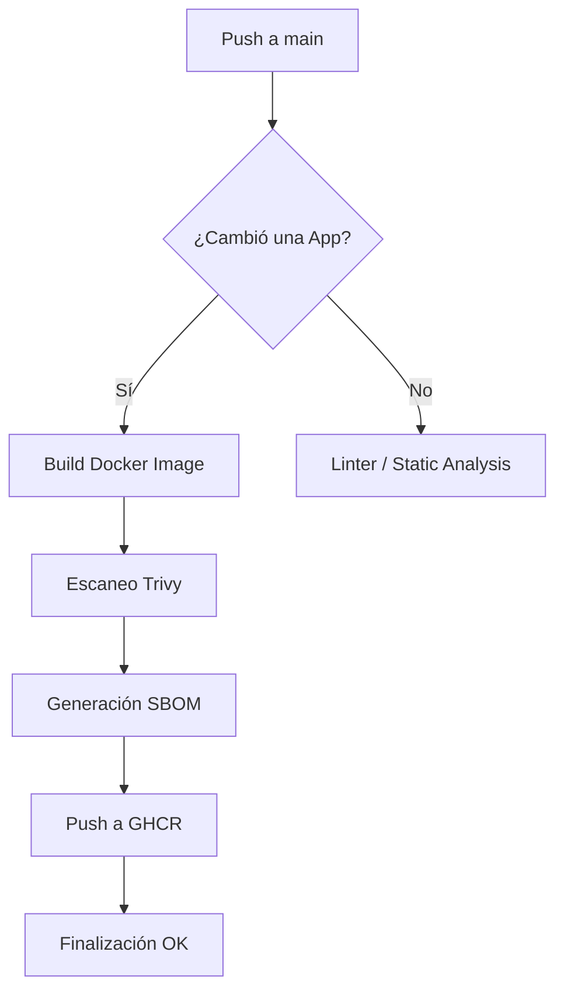

# Arquitectura - Microsistemas Suite

Este documento describe la estructura del proyecto, el flujo de datos y las decisiones de diseño que permiten que Microsistemas sea una suite robusta y modular.

## 🏗️ Estructura del Proyecto

El repositorio está organizado como un **monorepo**, donde el "Core" gestiona los recursos compartidos y las "Apps" contienen la lógica de negocio individual.

```text
/
├── apps/           # Todas las micro-herramientas (Módulos)
├── core/           # Clases base, Autoloading y Configuración
├── docs/           # Guías técnicas y manuales
├── scripts/        # Automatización de catálogo y revisión
├── .github/        # Workflows (CI/CD, Security, Wiki)
└── Makefile        # Orquestador de comandos
```

### El Core (`core/`)

La lógica compartida se organiza bajo el namespace `Microsistemas\`.

### 1. `Microsistemas\Core\Config`

Centraliza el acceso a la configuración.

- Utiliza `vlucas/phpdotenv` para cargar archivos `.env`.
- Método `get($key, $default)` para recuperación segura.

### 2. `Microsistemas\Core\Database`

Gestiona el ciclo de vida de la conexión MySQL.

- Implementa el patrón **Singleton** para evitar múltiples conexiones innecesarias.
- Inyecta automáticamente credenciales desde `Config`.

---

## 🚀 Flujo de CI/CD (GitHub Actions)

El ciclo de vida de cada cambio sigue este flujo automatizado:



1. **Linting**: Validación de estándares PSR-12 para PHP y PEP8 para Python.
2. **Seguridad**: Escaneo de secretos (TruffleHog) y vulnerabilidades en dependencias (Trivy).
3. **Distribución**: Publicación automática de imágenes en GitHub Container Registry (GHCR).

---

## 🐳 Capas del Contenedor (Dockerfile)

La imagen oficial se basa en `php:8.2-apache` para maximizar la compatibilidad:

1. **Base**: Debian Slim + Apache.
2. **Ext**: Instalación de `mysqli`, `pdo_mysql` y `gd`.
3. **App**: Copia del código y limpieza de rutas.
4. **Security**: Configuración de permisos `www-data` y deshabilitación de navegación por carpetas.

---

## 🛠️ Estándares Utilizados

- **PSR-4**: Autoloading de clases.
- **12-Factor App**: Configuración por variables de entorno.
- **Semantic Versioning (SemVer)**: Tags `v1.x.x` para el control de versiones.
