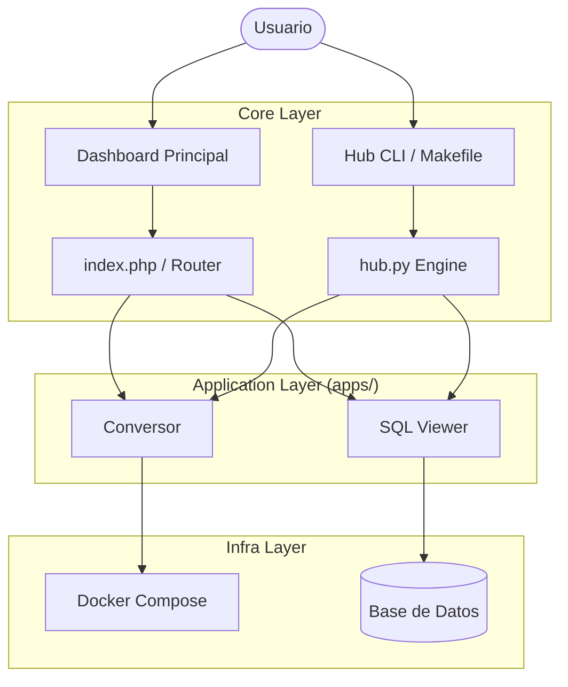

# Arquitectura del Sistema 🏗️

Microsistemas está construido bajo una filosofía modular y desacoplada, permitiendo que cada herramienta funcione de forma independiente compartiendo un núcleo mínimo.

## 🗺️ Diagrama de Componentes

## 📦 El Paquete PHP (`src/`)

La lógica compartida se organiza bajo el namespace `Microsistemas\`.

1.  **`Microsistemas\Core\Config`**: Centraliza el acceso a la configuración usando `.env`.
2.  **`Microsistemas\Core\Database`**: Gestiona la conexión MySQL mediante el patrón **Singleton**.

---

## 🔄 Integración Continua y Docker

- **CI/CD**: Cada push a `main` dispara la construcción y publicación automática en **GitHub Packages**.
- **Dockerfile**: Imagen basada en `php:8.2-apache`, optimizada para seguridad y rendimiento.

---
📖 Explora el **[Catálogo de Sistemas](Catalogo-de-Sistemas)** para ver el detalle de cada módulo.
